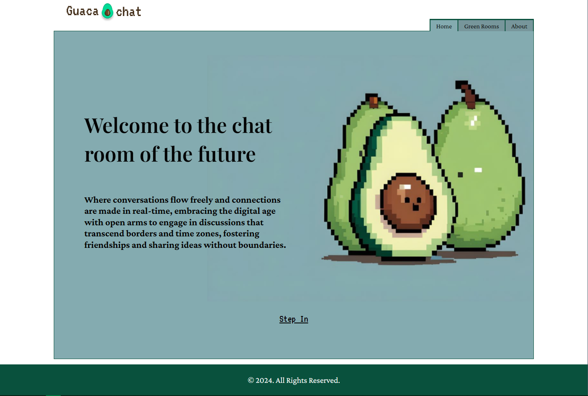

# Chat Application

[GuacaChat](https://guacachat.vercel.app/)

## Project Overview

This project is a real-time chat application built using [React](https://react.dev/) and [Friebase](https://firebase.google.com/). It allows users to send and receive messages in real-time.

## Features

- Real-time messaging
- User authentication
- Message history
- User presence indicators
- Message editing and deletion

## Technologies Used

- React
- Firebase
- Draft.js
- Sass

## Progress Log

- **Initial Setup (Date):**
  - Created basic project structure.
  - Set up Firebase for authentication and database.
- **User Interface (Date):**
  - Designed the user interface using React components.
  - Implemented the chat room layout.
- **User Authentication (Date):**
  - Implemented Firebase Authentication for user login and registration.
  - Secured the chat room to only allow authenticated users.
- **Real-time Messaging (Date):**
  - Integrated Firebase Realtime Database for real-time message synchronization.
  - Implemented message sending and receiving functionality.
- **Message History (Date):**
  - Implemented message history and scrolling functionality.
  - Added message timestamps.
- **Message Editing and Deletion (Date):**
  - Implemented message editing and deletion functionality.
  - Added confirmation dialogs for sensitive actions.

## Future Improvements

- Improve user presence indicators(online/offline).
- Add file sharing capabilities.
- Implement private messaging.
- Improve the user interface and user experience.
- Add notifications for new messages.

## Challenges Faced and Lessons Learned

- **Real-time Synchronization:** Learned about the challenges of synchronizing data in real-time and how to use Firebase Realtime Database effectively.
- **Error Handling:** Implemented robust error handling mechanisms to ensure a smooth user experience.
